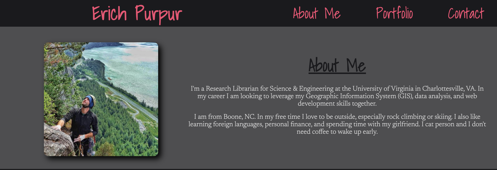

# Bootcamp8_OnlinePortfolio

Now that I've had some practice with APIs and have a project to share, I'll be updating my portfolio page and other materials to build toward being employer-competitive.

## My Portfolio Items

* Link to Portfolio: [https://epurpur.github.io/Bootcamp8_OnlinePortfolio/](https://epurpur.github.io/Bootcamp8_OnlinePortfolio/)
* Link to Resume: [https://github.com/epurpur/Bootcamp8_OnlinePortfolio/blob/main/assets/images/ErichPurpurResume.pdf](https://github.com/epurpur/Bootcamp8_OnlinePortfolio/blob/main/assets/images/ErichPurpurResume.pdf)
* Link to GitHub profile: [https://github.com/epurpur](https://github.com/epurpur)
* Link to LinkedIn Profile: [https://www.linkedin.com/in/erich-purpur-140a1433/](https://www.linkedin.com/in/erich-purpur-140a1433/)

## Note for Grader
I know I did not follow outline for required items in my portfolio exactly. I liked the way my portfolio looked so I changed things accordingly.

## Preview of Portfolio

